# 📚 ApolloGPT - AI-Powered School Assistant

**ApolloGPT** is a React Native mobile application built with [Expo](https://expo.dev/) that acts as a smart AI chatbot designed to help students with their school subjects. The bot provides educational support in **English**, **Math**, **Science**, and **ICT**, answering only within each specific field to ensure focused and accurate guidance.

## 🌟 Features

- 🤖 AI-powered responses tailored to:
  - **English** – Grammar, literature, vocabulary, etc.
  - **Math** – Arithmetic, algebra, geometry, and more.
  - **Science** – Physics, biology, chemistry basics.
  - **ICT** – Computers, software, and digital literacy.
- 🛠️ **Admin Dashboard**
  - Verify new user accounts.
  - Monitor active users.
  - Delete or manage accounts.
  - Control token allocation.
- 🔐 **Authentication & Authorization**
  Secure user authentication with account verification.
- ⚡ **Real-Time Messaging**
  Seamless chat experience using WebSockets for live responses.
- 💾 Local data management with Expo SQLite.
- 📝 Support for Markdown rendering in chat responses.
- 🎨 Responsive animations powered by React Native Reanimated and Redash.
- 📲 **Cross-Platform**
  Works on both Android and iOS using a single codebase.

## 📸 Screenshots

    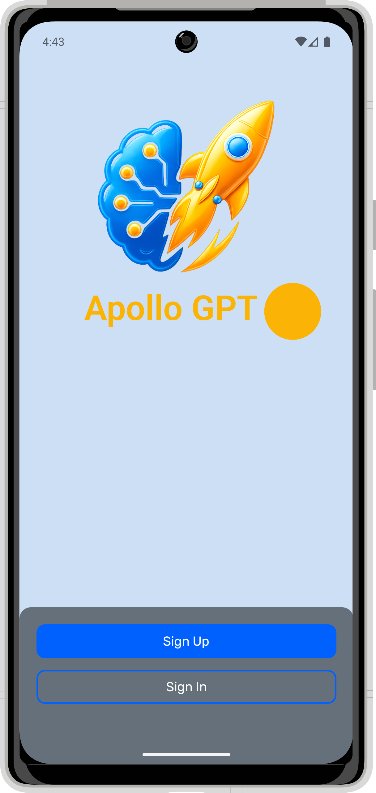
    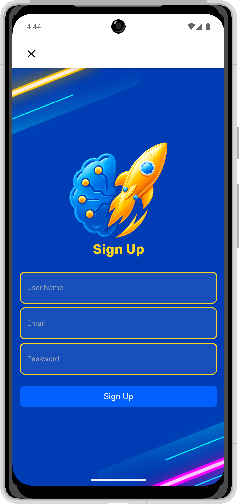
    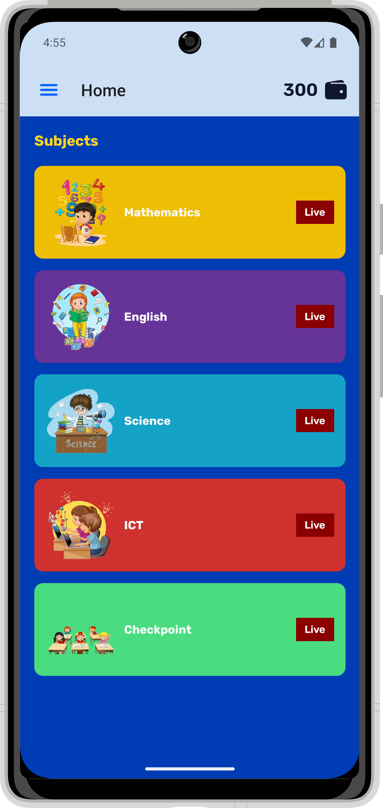
    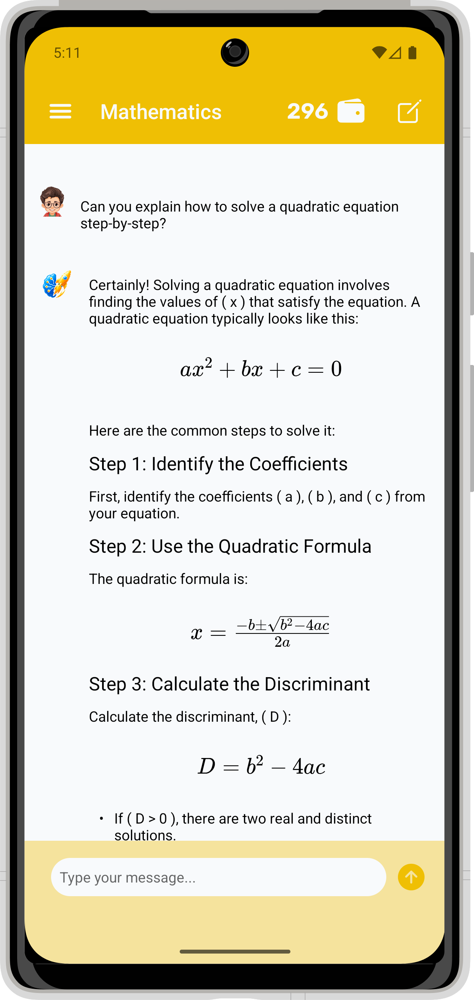
    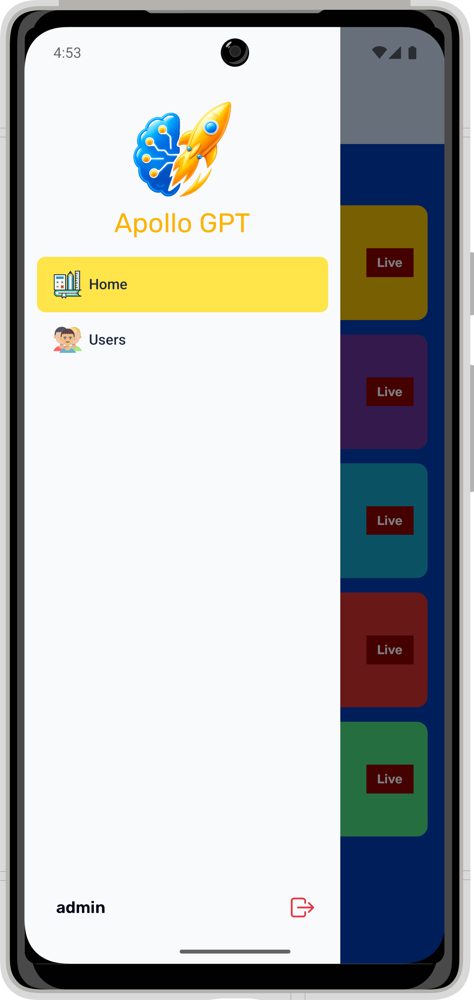
    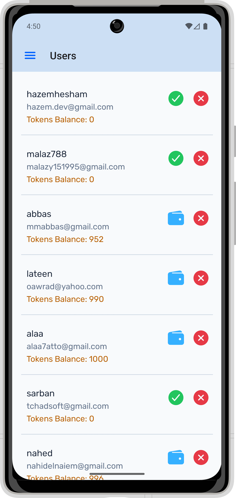
    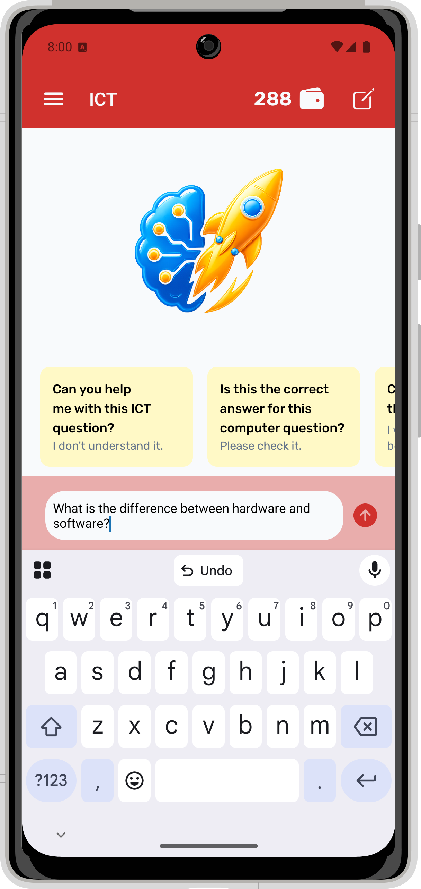
    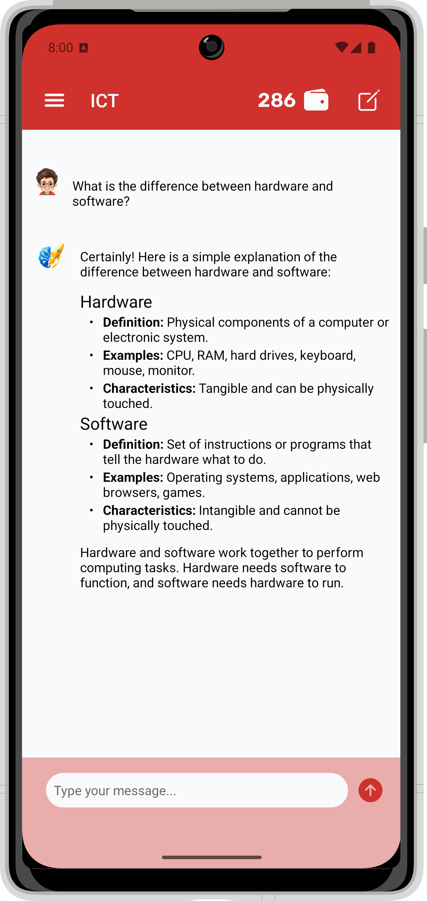
    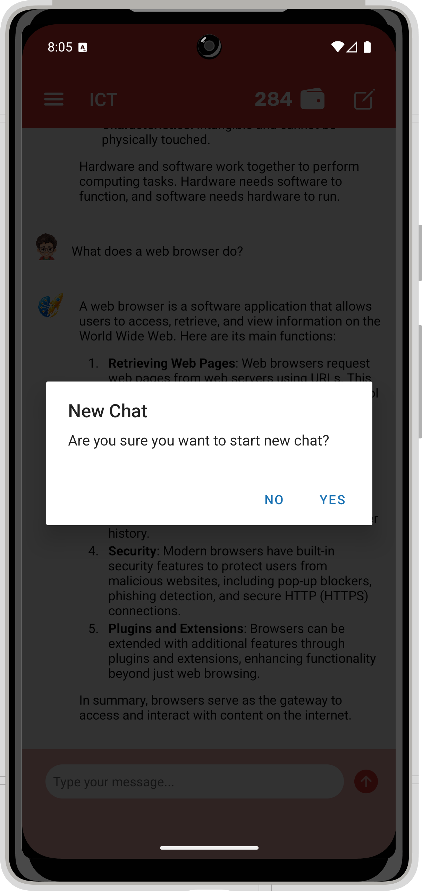
    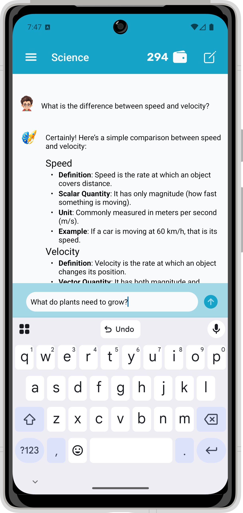
    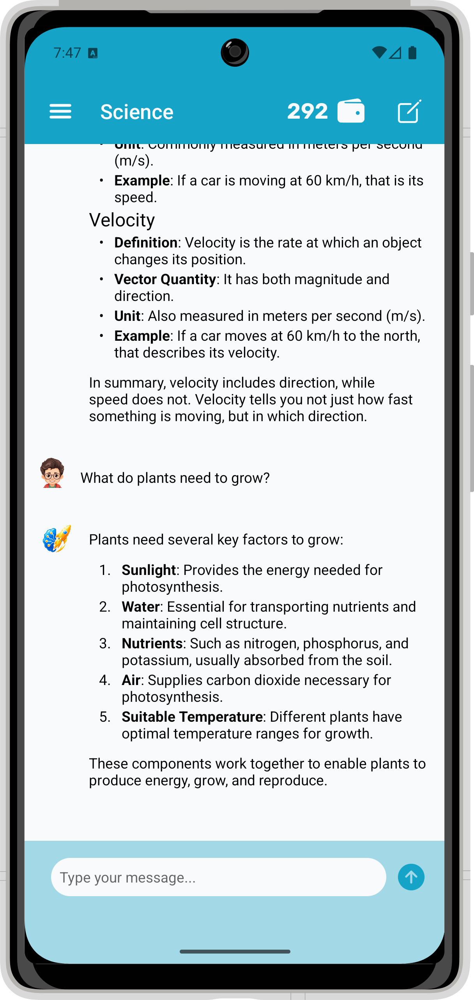
    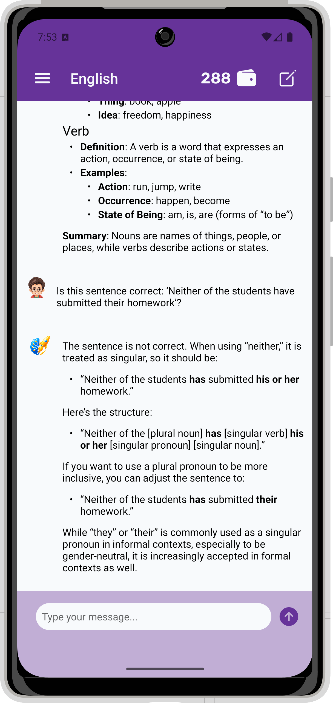

<!-- ## 🎬 Demo

Check out Apollo GPT in action! Below is a quick preview of the app running on a mobile device. -->

## ⚡ How to Use

1. Open the app on your device.
2. Sign up for a new account.
3. Wait for admin verification to activate your account.
4. Once verified, log in to access the app.
5. Select a subject: English, Math, Science, or ICT.
6. Ask your question related to the chosen subject.
7. Receive AI-powered, subject-focused answers.
8. Keep questions relevant for best results.
9. Token usage is tracked and limited per user.

## 🚀 Tech Stack

### Frontend (Mobile App)
- [React Native](https://reactnative.dev/docs/environment-setup/) — framework for building native mobile apps using React and JavaScript.
- [Expo Router](https://docs.expo.dev/routing/introduction/) — file-based navigation and routing within the React Native app.
- [Socket.IO Client](https://socket.io/docs/v4/client-api/) — used to connect to the backend for live interaction with the OpenAI API.
- [React Native Reanimated](https://docs.swmansion.com/react-native-reanimated/) — high-performance animations library for smooth gesture handling and transitions.
- [Expo SQLite](https://docs.expo.dev/versions/latest/sdk/sqlite-next/) — embedded database for storing and managing data locally on the device using SQL.
- [React Native Markdown Display](https://github.com/iamacup/react-native-markdown-display/) — renders styled Markdown content in React Native apps.

### Backend (API Server)
- [Node.js](https://nodejs.org/) — fast, scalable backend runtime for building APIs and server-side logic.
- [Express.js](https://expressjs.com/) — minimalist web framework for building fast and flexible RESTful APIs.
- [OpenAI API](https://platform.openai.com/) — provides AI-powered natural language understanding and generation for subject-specific responses.
- [Socket.IO](https://socket.io/docs/v4/) — enables real-time communication between the backend and the mobile app.
- [Axios](https://axios-http.com/docs/intro/) — HTTP client for making API requests in Node.js.

## 🙋‍♀️ Contact Me

For questions, feedback, or support, feel free to reach out:

**GitHub:** [hazemhesham-1](https://github.com/hazemhesham-1)